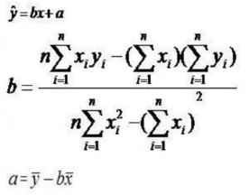
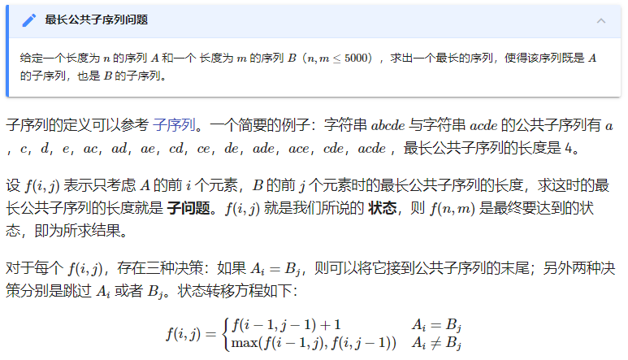

# 总结

这场比赛只过了两个题：G 和 J。G 是个简单构造题，J 是个基础数学题（竟然卡精度，最开始就用double 过不去）。


# 题解

TO BE COMPLETED


## D

### yh

这道题就是一个简单图论：将图边权取对，给所有边权重同时减去一个值，使得所有环都是负环，问这个值的最小值。

spfa 思路可以求出一个图 “是否存在负环”，而要让所有环都是负环，则可以考虑 “是否存在正环”，于是将所有边取相反数。

二分答案就解决了。

```cpp
#include<bits/stdc++.h>
#define ll long long
#define lll __int128
using namespace std;

inline int read() {
    int x = 0, f = 1;
    char ch = getchar();
    while (ch < '0' || ch>'9') { if (ch == '-')f = -1;ch = getchar(); }
    while (ch >= '0' && ch <= '9') { x = x * 10 + ch - '0';ch = getchar(); }
    return x * f;
}

const ll MAX = 3e3;

int n, m;
vector<int> target[MAX];
double len[MAX][MAX];

bool in_queue[MAX];
double min_dis[MAX];
int path_len[MAX];

bool exist_neg(double offset) {
    queue<int> q;
    for (int i = 1;i <= n;i++) {
        q.push(i);
        in_queue[i] = true;
        min_dis[i] = 0;
        path_len[i] = 0;
    }
    while (!q.empty()) {
        int node = q.front();
        q.pop();
        in_queue[node] = false;
        // found a negtive circle
        if (path_len[node] >= n) return true;
        for (int dst : target[node]) {
            double w = len[node][dst] + offset;
            if (min_dis[node] + w < min_dis[dst]) {
                path_len[dst] = path_len[node] + 1;
                min_dis[dst] = min_dis[node] + w;
                // re-queue to update distance from dst
                if (!in_queue[dst]) {
                    q.push(dst);
                    in_queue[dst] = true;
                }
            }
        }
    }
    return false;
}

bool check(double value) {
    return !exist_neg(value);
}

int main() {
    n = read(), m = read();
    for (int i = 0;i <= n;i++) {
        for (int j = 0;j <= n;j++) {
            len[i][j] = 1e100;
        }
    }
    for (int i = 0;i < m;i++) {
        int a = read(), b = read(), c = read(), d = read();
        double val = -log(c / (double)a);
        target[b].push_back(d);
        len[b][d] = min(val, len[b][d]);
    }
    double l = -1e3, r = 0;
    while (r - l > 1e-7) {
        double m = (l + r) / 2;
        if (check(-m)) l = m;
        else r = m;
    }
    printf("%.10lf", exp(l));
}

/*

4 5
1 1 2 2
1 2 4 3
1 3 2 4
1 4 1 1
1 2 3 1

0.4082482905

*/
```


## G

### yh

G 是个构造题。考虑分组，组内递增，组间递减，最小值为根号。**至于为什么，参见 Solution。**

```cpp
#include<bits/stdc++.h>
#define ll long long
#define lll __int128
using namespace std;

const ll MAX = 5e5;

int main() {
    ios::sync_with_stdio(false);
    cin.tie(NULL);
    cout.tie(NULL);
    int t;
    cin >> t;
    while (t--) {
        int n;
        cin >> n;
        int m = 1;
        for (;m * (ll)m < (ll)n;m++);
        for (int group = (n + m - 1) / m;group >= 0;group--) {
            int val;
            for (int i = 0;i < m && (val = i + group * m) < n;i++)
                printf("%d ", val + 1);
        }
        printf("\n");
    }
}
```


## J

### yh

这是个最小二乘解线性回归。公式贴在这：



这个题就离谱，tnnd，卡精度，后面用 `__int128` 才过。

```cpp
#include<bits/stdc++.h>
#define ll long long
#define lll __int128
using namespace std;

inline ll read() {
    ll x = 0, f = 1;
    char ch = getchar();
    while (ch < '0' || ch > '9') { if (ch == '-')f = -1;ch = getchar(); }
    while (ch >= '0' && ch <= '9') { x = x * 10 + ch - '0';ch = getchar(); }
    return x * f;
}

const ll MAX = 5e5;
ll x[MAX], y[MAX];


int main() {
    // ios::sync_with_stdio(false);
    // cin.tie(NULL);
    // cout.tie(NULL);
    ll t = read();
    while (t--) {
        ll n = read();
        lll cross_sum = 0;
        lll x_sum = 0;
        lll y_sum = 0;
        lll x2_sum = 0;
        for (int i = 0;i < n;i++) {
            x[i] = i;
            y[i] = read();
            cross_sum += x[i] * (lll)y[i];
            x_sum += x[i];
            y_sum += y[i];
            x2_sum += x[i] * (lll)x[i];
        }
        double b = (n * (double)cross_sum - x_sum * (double)y_sum)
            / (n * (double)x2_sum - x_sum * (double)x_sum);
        double a = y_sum / (double)n - b * x_sum / (double)n;
        double ans = 0;
        for (int i = 0;i < n;i++) {
            double y_predict = b * i + a;
            ans += (y_predict - y[i]) * (y_predict - y[i]);
        }
        printf("%.9lf\n", ans);
    }
}
```


## K

### yh

#### 最长公共子序列（LCS）

> 摘自 OI-WIKI



#### 回到题目

令 `dp[x][y][z]` 表示 a 的前 y 位是 b 的前 x 位的子序列，且 b 的前 x 位中左括号数比右括号数多 z 的总情况数。因为构造的 b 是一个符合要求的括号序列，故中间过程 z 一定是一个非负整数（栈）。

```cpp
#include<bits/stdc++.h>
#define ll long long
#define lll __int128
using namespace std;

const ll MOD = 1e9 + 7;

void append(ll& dst, ll src) {
    dst %= MOD;
    dst += src;
    dst %= MOD;
}

char a[300];
ll dp[300][300][300] = { 0 };
int main() {
    int t;
    scanf("%d", &t);
    while (t--) {
        int n, m;
        scanf("%d%d%s", &n, &m, a);
        for (int x = 0;x <= m + 1;x++) for (int y = 0;y <= m + 1;y++) for (int z = 0;z <= m + 1;z++) dp[x][y][z] = 0;
        dp[0][0][0] = 1;
        for (int x = 0;x < m;x++) {
            for (int y = 0;y <= x && y < n;y++) {
                for (int z = 0;z <= x;z++) {
                    if (a[y] == '(') {
                        append(dp[x + 1][y + 1][z + 1], dp[x][y][z]); // b[x] == '('
                        if (z > 0) append(dp[x + 1][y][z - 1], dp[x][y][z]); // b[x] == ')'
                    }
                    else {
                        append(dp[x + 1][y][z + 1], dp[x][y][z]); // b[x] == '('
                        if (z > 0) append(dp[x + 1][y + 1][z - 1], dp[x][y][z]); // b[x] == ')'
                    }
                }
            }
            // for y == n:
            for (int z = 0;z <= x;z++) {
                append(dp[x + 1][n][z + 1], dp[x][n][z]); // b[x] == '('
                if (z > 0) append(dp[x + 1][n][z - 1], dp[x][n][z]); // b[x] == ')'
            }
        }
        printf("%lld\n", (dp[m][n][0] % MOD + MOD) % MOD);
    }
}
```

计算 dp 可以采取两种方案：

- 拉式：通过已经算出的 dp 值计算当前的 dp；
- 推式：当前的 dp 值已经算出，于是计算它对未来 dp 值的贡献。

本题采用后者更方便。


## C

xf

题目背景为NIM游戏，有两个玩家，n堆石子，玩家双方轮流行动，每次从一堆石子中取走一些石子，最后谁取走最后一个石子就获胜，此题问两个问题，一，胜利方想尽快胜利，失败方想尽可能拖延，问总共能进行多少回合。二，在此基础上，先手第一回合可以进行几种操作

最重要的两个结论：

1. 某回合异或值为0时，先手获胜
2. 必败的一方，如果想尽可能拖延时间，则以后每一次操作中双方都只能取一个石头

首先用n堆石子异或值是否为0判断先手必胜还是必败，然后分为必胜和必败情况讨论。

- 先手必胜

  先手会进行操作一次，使得剩余的石子数异或值为0，同时为了尽快结束游戏，先手会尽可能多的取石子，方案数为第一回合结束后的石子总数+1，方案数为能够满足操作后石子异或为0的石子堆数

- 先手必败

  游戏轮数比较简单，就是石头总数，而求操作数这部分有点复杂。先手从某一堆里拿走一个石头，要判断后手能不能再拿一个使得整体异或值为0

```cpp
#include<bits/stdc++.h>
#define rep(i,st,en) for(ll i=st;i<=en;i++)
#define REP(i,st,en) for(ll i=st;i>=en;i--)
#define el printf("\n");
using namespace std;
typedef long long ll;
typedef pair<int,int>pii;
int n,t,a[100010];
int lowbit(int x)
{
	return x&(-x);
}
int main()
{
	scanf("%d",&t);
	while(t--){
		scanf("%d",&n);
		int xo=0;
		ll sum=0;
		rep(i,1,n)
		{
			scanf("%d",&a[i]);
			xo^=a[i];
			sum+=a[i];
		}
		if(xo==0)//先手必败 
		{

			int cnt=0;
			rep(i,0,29)//二进制下第i位能否作为最低位 
			{
				int tmp=0,fl=0;
                 //tmp是最低位是第i位的石子堆数
                 //fl判断最低位是否为第i位
				for(int j=1;j<=n;j++)
				{
					if(a[j]&((1<<i)))
					{
						tmp++;
						if(lowbit(a[j])<(1<<i))
							fl=1; 
					}
				}
				if(fl==0)
					cnt+=tmp;
				//二进制最低位是第i位的石子堆数个数 
			}
			printf("%lld %d\n",sum,cnt);
			//先手尽可能拖延，后手维持平衡，则每次一人拿一个石头
			//共进行sum轮 
		}
		else//先手必胜 
		{
			int cnt=0,maxx=-1;
			rep(i,1,n)
			{ 
				int tmp=a[i]-(a[i]^xo);
				//设a[i]^xo=b，为其余n-1堆的异或值
				//a[i]减去tmp后剩下b，再与其余n-1堆异或起来就是0了 
				if(tmp>maxx)
					maxx=tmp;
			}
			//找到最大的tmp使得从a[i]中拿走tmp个石子后剩余石子异或值为0
			//取最大是为了先手最快结束游戏 
			rep(i,1,n)
				if(maxx==a[i]-(a[i]^xo))
					cnt++;
					
			printf("%lld %d\n",sum-maxx+1,cnt);
			//先手一下拿走maxx个，使得所有石子异或值为0
			//后手为了拖延只能一个一个拿，进入必败循环 
		}
	}
	return 0;
}

```

## L

xf

题意为有n个世界，m个节点，每一个世界中有一些条有向边，在每一个世界，主角可以要么待在原来的节点，要么沿着某条边走一次，求从节点1走到节点m最少需要的连续世界数。

考虑dp，$$dp[i][j]$$可表示为到世界i为止，抵达节点j所需的最少世界数，对于世界i中的边<u,v>，有两种转移方式，$dp[i][v]=min(dp[i-1][v]+1,dp[i-1][u]+1)$

原始版：（占坑）

```cpp

```

可以使用滚动数组优化成以下写法：

```cpp
#include<bits/stdc++.h>
#define rep(i,st,en) for(int i=st;i<=en;i++)
#define REP(i,st,en) for(int i=st;i>=en;i--)
#define el printf("\n");
using namespace std;
typedef long long ll;
typedef pair<int,int>pii;
int n,m,l,u,v;
int dp[10010],dp2[10010];
//dp[i]代表到达节点i最少需要的世界数
//dp2[i]代表在枚举到某一世界时，到达节点i最少需要的世界数（中间过程） 
int main()
{
	scanf("%d%d",&n,&m);
	rep(i,2,m)
	{
		dp[i]=99999999;
		dp2[i]=99999999;
	}
	dp[1]=1,dp2[1]=1;
	
	rep(i,1,n)
	{
		scanf("%d",&l);
	
		rep(i,2,m-1)
			if(dp[i]!=99999999)
				dp[i]++;//能走到的话就++
		//先算基础的不走的情况 
		//第1和第m个节点不需要走，只需要看当前答案与从其他点走过来的哪个更小即可 
		rep(i,1,m)
			dp2[i]=dp[i]; 
		//先复制给中间值
		
		while(l--){
			scanf("%d%d",&u,&v);
			dp2[v]=min(dp2[v],dp[u]);
			//从点不变转移而来的方案、从u转移来的方案 
		}
		// 再算走的情况，比较一下从u到v或者在v不动哪个需要世界数少		
		
		for(int i=1;i<=m;i++)
			dp[i]=min(dp[i],dp2[i]);
		
	}
	if(dp[m]==99999999)
		printf("-1");
	else
		printf("%d",dp[m]);
	return 0;
}
```

## I let fat tension

### zhn

题意：给定 $n$ 个 $k$ 维向量 $\{X_i\}$，和 $n$ 个 $d$ 维向量 $\{Y_i\}$，求 $Y'_j=\sum_{i=1}^n \dfrac{X_i\cdot X_j}{|X_i||X_j|} $ ,其中$ n≤1×10^4,d≤50,k\leq 50。$

这题一开始看到给的式子，就想到了$cos$值，然后就一直被卡着了，但其实如果把求和式子里面的的两个向量看成两个向量，就可以化成矩阵相乘的形式，可以大大降低时间复杂度。

感觉不太好想到变成一堆矩阵的形式。

~~很喜欢张宇老师的一句话，要用向量的思维来研究矩阵，反过来一样，我是铸币~~

代码

```c++
#include <bits/stdc++.h>
using namespace std;
const int N=1e4+10;
int n,k,d;
int a[N][55],b[N][55];
double a_new[N][55],a_new_T[55][N];//转置与原本矩阵
double temp[55][55],ans[N][55];
inline int read(){
    int x=0,f=1;
    char ch=getchar();
    while(ch<'0'||ch>'9'){if(ch=='-')f=-1;ch=getchar();}
    while(ch>='0'&&ch<='9'){x=x*10+ch-'0';ch=getchar();}
    return x*f;
}
inline void solve(){
    for(int i=1;i<=k;i++){
        for(int j=1;j<=d;j++){
            for(int o=1;o<=n;o++){
                temp[i][j]+=a_new_T[i][o]*(double)(b[o][j]);
            }
        }
    }
    for(int i=1;i<=n;i++){
        for(int j=1;j<=d;j++){
            for(int o=1;o<=k;o++){
                ans[i][j]+=a_new[i][o]*temp[o][j];
            }
        }
    }
    for(int i=1;i<=n;i++){
        for(int j=1;j<=d;j++){
            printf("%.10lf ",ans[i][j]);
        }
        cout<<endl;
    }
    return ;
}
int main(){
    n=read();k=read();d=read();
    for(int i=1;i<=n;i++)
        for(int j=1;j<=k;j++)
            a[i][j]=read();

    for(int i=1;i<=n;i++)
        for(int j=1;j<=d;j++)
            b[i][j]=read();

    for(int i=1;i<=n;i++){
        double len=0.000;
        for(int j=1;j<=k;j++){
            len+=(double)(a[i][j])*a[i][j];
        }
        len=sqrt(len);
        for(int j=1;j<=k;j++){
            a_new[i][j]=(double)a[i][j]/len;
            a_new_T[j][i]=a_new[i][j];
        }
    }
    solve();
    return 0;
}
```

