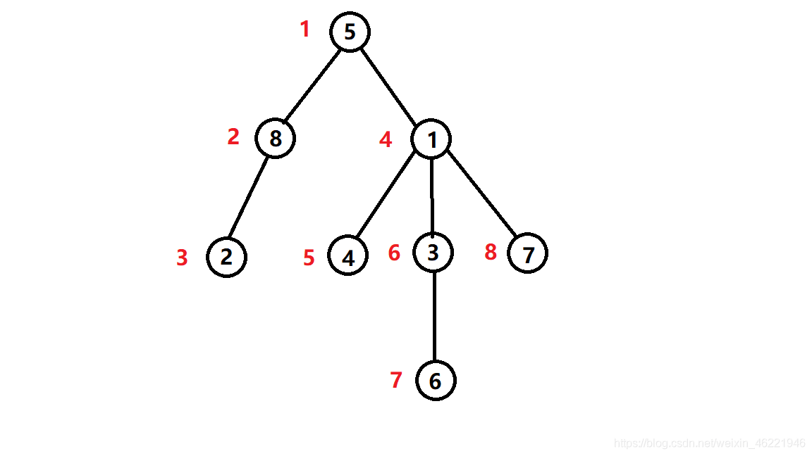

# 模板汇总（随着暑假改题不断更新）


## DFS序



```c++
void dfs1(int s,int fa){
    dfn1[s]=++id1;
    dep1[s]=dep1[fa]+1;
    fa1[s][0]=fa;
    siz1[s]=1;
    for(int i=1;i<=20;i++)
        fa1[s][i]=fa1[fa1[s][i-1]][i-1];

    for(auto u:A[s]){
        if(u==fa) continue;
        dfs1(u,s);
        siz1[s]+=siz1[u];
    }
    return ;
}
```

